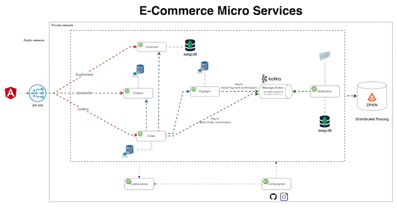

# E-Commerce Microservices

This repository contains the implementation of an E-Commerce application using microservices architecture. The application is designed to handle various aspects of an e-commerce system, such as customer management, product management, order processing, payment processing, and notifications.

## Architecture

The architecture of the E-Commerce microservices application is depicted in the following diagram:



### Components

1. **API Gateway**
    - Exposes APIs for customers, products, and orders.
    - Routes requests to the appropriate microservices.
    - Uses Angular for the frontend.

2. **Customer Service**
    - Manages customer data.
    - Uses MongoDB for data storage.

3. **Product Service**
    - Manages product data.
    - Uses Docker for containerization.

4. **Order Service**
    - Manages order processing.
    - Uses Docker for containerization.

5. **Payment Service**
    - Handles payment processing.
    - Sends asynchronous payment confirmation messages to Kafka.

6. **Notification Service**
    - Sends order and payment notifications.
    - Subscribes to Kafka topics for notifications.
    - Uses MongoDB for data storage.

7. **Message Broker (Kafka)**
    - Facilitates asynchronous communication between services.
    - Handles message queues for order confirmations and payment confirmations.

8. **Eureka Server**
    - Service registry for microservices.

9. **Config Server**
    - Centralized configuration management for microservices.

10. **Distributed Tracing (Zipkin)**
    - Traces and monitors requests across microservices.

11. **Authentication (Keycloak)**
   - Manages authentication and authorization.
   - Requires inputting credentials when calling services.

## Technologies Used

- **Backend**: Spring Boot, Spring Cloud
- **Message Broker**: Apache Kafka
- **Databases**: MongoDB
- **Containerization**: Docker
- **Service Discovery**: Eureka
- **Configuration Management**: Spring Cloud Config
- **Distributed Tracing**: Zipkin

## Getting Started

### Prerequisites

- Docker
- Docker Compose
- Java 17+

### Installation

1. Clone the repository:
   ```bash
   git clone https://github.com/wzzktndl/spring-ecommerce-app
   cd e-commerce-microservices
   ```

2. Start the services using Docker Compose:
   ```bash
   docker-compose up
   ```

3. Setup KeyCloak
- Go to `http://localhost:9098`.
- Create realm `micro-service`.
- Create client `Client ID` with `micro-services-api`.
- Check `Client authentication` and `Authorization` on, but checkout another.
- Get `Client Secret` 
- The `authorization_endpoint` will be `http://localhost:9098/realms/micro-service/protocol/openid-connect/auth`
```text
If using postman, change authentication to oauth2 and configure Grant type to Client Credentials and input your credential 
- Client ID
- Client Secret
- Access Token URL
```   

4. Start micro-services from config-service,discovery-service then another service.
   
## License

This project is licensed under the MIT License.